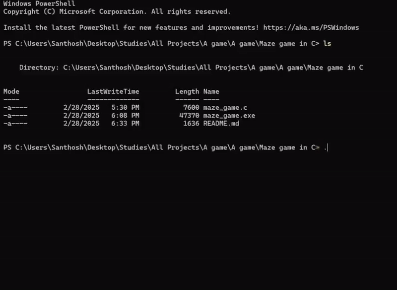

# TUI Maze Game

A maze game that runs entirely in the terminal, built only with C and its standard libraries



## Motivation

I built this game in the first semester of college, back when I only knew C, the imperative programming paradigm and C's standard libraries

That was *not* enough to make a game, but I really wanted to. After months of failures and revelations, what seemed impossible at first suddenly happened!

I made a game without any object-oriented programming or external libraries!

## Quickstart

### Windows

- Click on `maze_game_windows.exe`
- Click on the download button on the right
- Open powershell or command prompt in the exe's folder
- Run it with `./maze_game_windows.exe`

### Unix (Linux or MacOS)

- Requirements:
    - A c compiler, ex. gcc or clang

- Either download the project as a zip file and extract it or:

```bash 
# clone the project onto your machine
git clone https://github.com/Santhosh-Paramasivam/cli-maze.git
```

- Compile the source code

``` bash
gcc maze_game.c -o maze_game.exe
```

- Run it with `./maze_game.exe` or equivalent

## Gameplay and controls  

Upon executing the `maze_game.exe` file or any equivalent file, two A's can be spotted.

``` text
    A     O  O
 OOOOOO   OO O
   O   OOO  OO
             O
 OOOOO  OOOO O
 O       O   O
 O       O   O
OOOO  O    O O
    O OOOOOO O
 O  O        O
OOOOOOOOO A OO
```

WASD keys can be used to move the character (get it? it's both a character in the story and a literal character).

The A at the top is the character to move and the A at the bottom is the destination to move it to.  

The Os represent walls which cannot be traversed.  

When the top A reaches the bottom A, the game ends and the user is given the option to replay the game.

``` text
OO    OO    OOOO     OO    OO                    
 OO  OO   OOO  OOO   OO    OO                    
  OOOO    OO    OO   OO    OO                    
   OO     OO    OO   OO    OO                    
   OO     OOO  OOO   OO    OO                    
   OO       OOOO       OOOO                      
                                                 
 O              O     OOOOO     OO    OO   ||  ||
 OO            OO   OOO   OOO   OOO   OO   ||  ||
  OO          OO    OO     OO   OO O  OO   ||  ||
   OO   OO   OO     OO     OO   OO  O OO   ||  ||
    OO O  O OO      OOO   OOO   OO   OOO         
     OO    OO         OOOOO     OO    OO   OO  OO

You won! Hit anything to play again!
```  
